# nacos-study
学习nacos源码，添加注释

nacos版本为`1.4.1`

## 源码编译
进入nacos目录，执行编译命令, 增加 `-Drat.skip=true` 参数 ，跳过licensing 检查
```shell
mvn -Prelease-nacos -Dmaven.test.skip=true -Drat.skip=true clean install -U 
```

编译成功后会在distribution/target目录下生成nacos-server-1.4.1.tar.gz

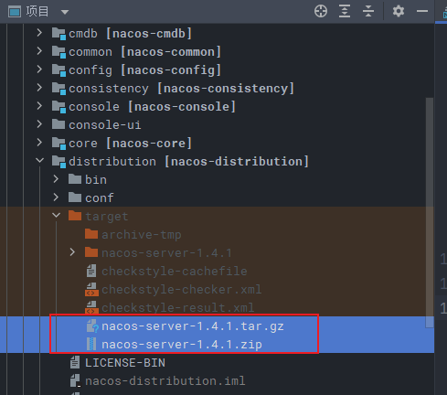


## 启动nacos

### 1、进入`console`模块

​	找到启动类 `com.alibaba.nacos.Nacos.java`

### 2、配置启动参数

2.1 单机模式执行需要指定`nacos.standalone=true`

```shell
 -Dnacos.standalone=true
```

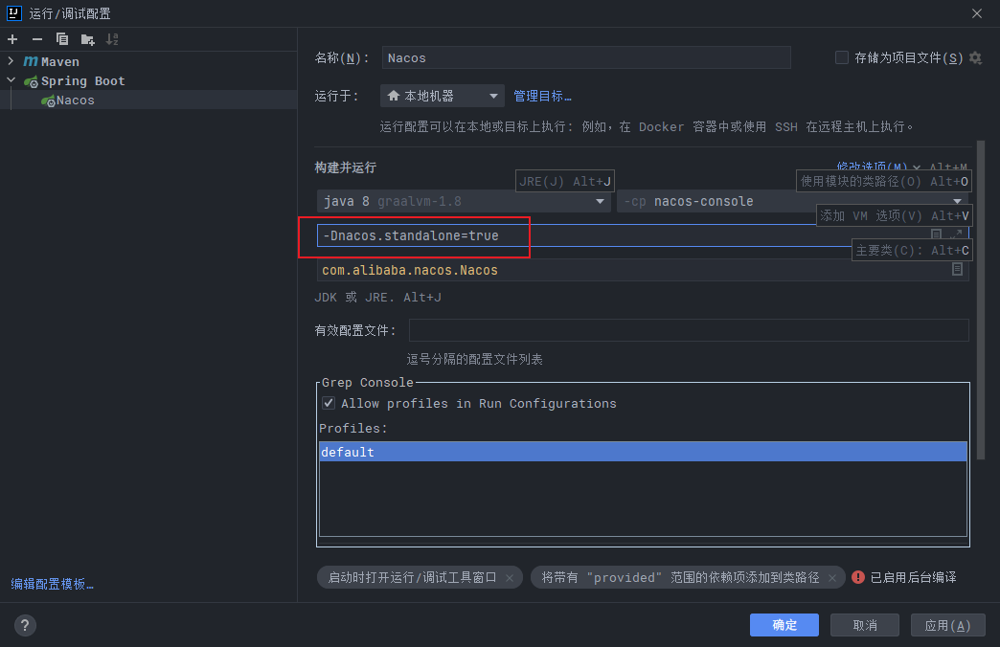


如果有报错：

>  java: 程序包com.alibaba.nacos.consistency.entity不存在

`consistency`工程`compile`一下


2.2 启动main

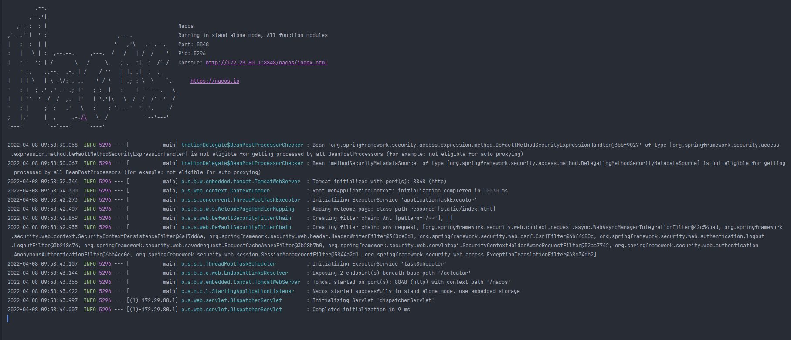


### 3、集群启动

nacos集群需要配置mysql存储，需要

3.1 先创建数据库

3.2 执行 `distribution/conf` 目录下的 `nacos-mysql.sql` 脚本

3.3 修改 `console\src\main\resources` 目录下的 `application.properties` 文件里的mysql配置

   ```properties
   #*************** Config Module Related Configurations ***************#
   ### If use MySQL as datasource:
   spring.datasource.platform=mysql
   
   ### Count of DB:
   db.num=1
   
   ### Connect URL of DB:
    db.url.0=jdbc:mysql://127.0.0.1:3306/nacos_config?characterEncoding=utf8&connectTimeout=1000&socketTimeout=3000&autoReconnect=true&useUnicode=true&useSSL=false&serverTimezone=UTC
    db.user.0=root
    db.password.0=root
   
   #*************** Naming Module Related Configurations ***************#
   ```


3.4 运行console模块里的 `com.alibaba.nacos.Nacos.java`，需要增加启动vm参数端口号和实例运行路径nacos.home(对应的目录需要自己提前创建好)，每台server的`nacos.home`目录里需要创建一个`conf`文件夹，里面放一个`cluster.conf`文件，文件里需要把所有集群机器ip和端口写入进去

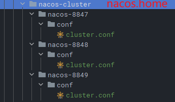

```properties
127.0.0.1:8847
127.0.0.1:8848
127.0.0.1:8849
```

```properties
-Dserver.port=8847 -Dnacos.home=D:\idea_source_projects\nacos-study\nacos-1.4.1\nacos-cluster\nacos-8847
-Dserver.port=8848 -Dnacos.home=D:\idea_source_projects\nacos-study\nacos-1.4.1\nacos-cluster\nacos-8848
-Dserver.port=8849 -Dnacos.home=D:\idea_source_projects\nacos-study\nacos-1.4.1\nacos-cluster\nacos-8849
```


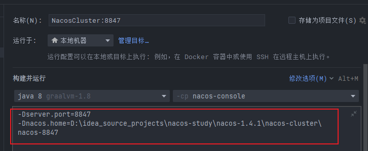

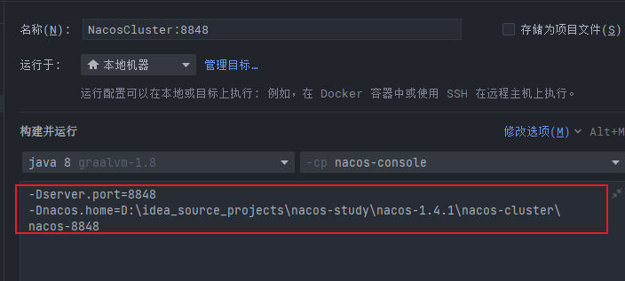

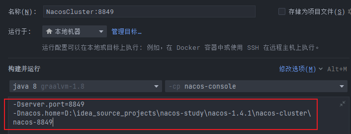


3.5 分别启动三个Nacos实例

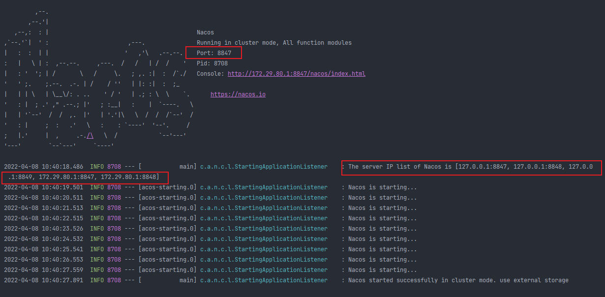


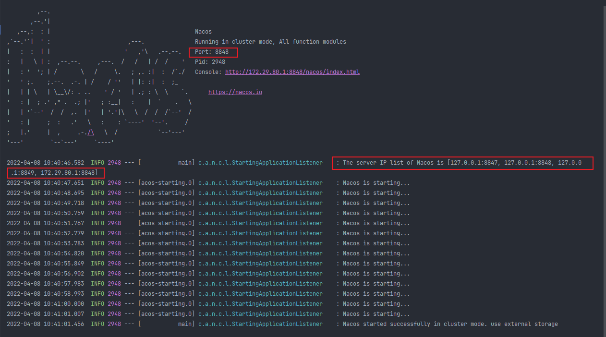


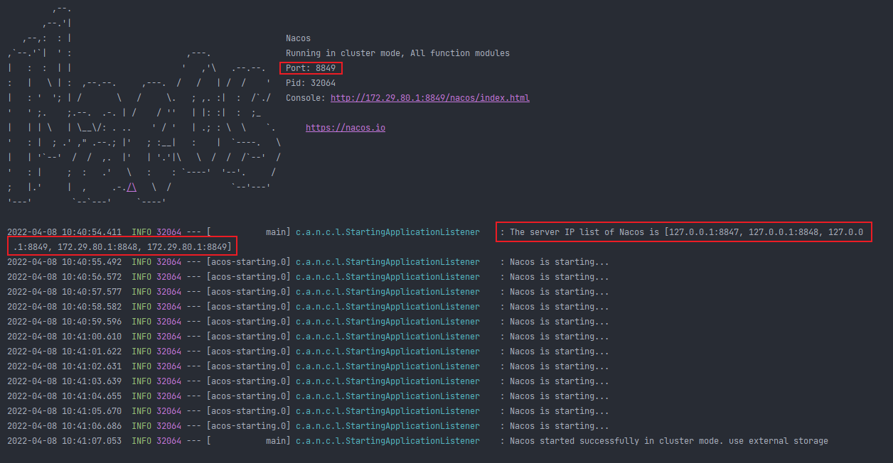


3.6 浏览器打开 `http://localhost:8847/nacos`,`http://localhost:8848/nacos`,`http://localhost:8849/nacos`,都能进入主界面

   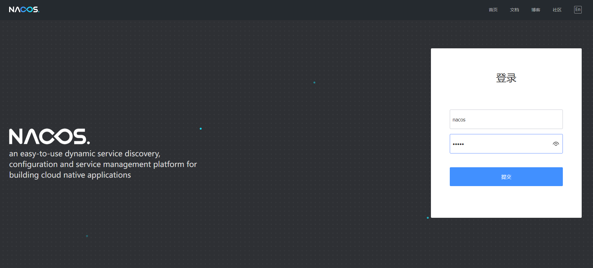


3.7 用户名密码均为`nacos`

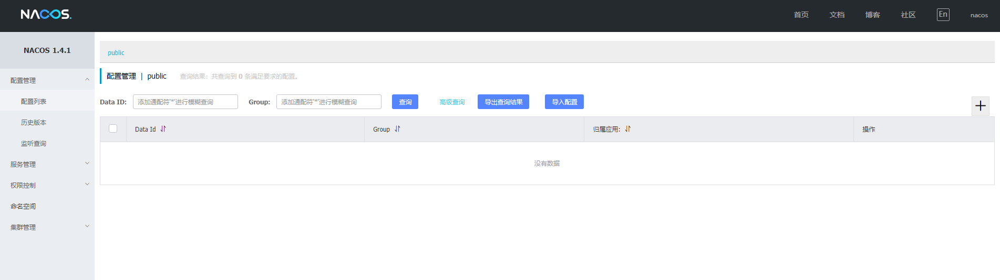